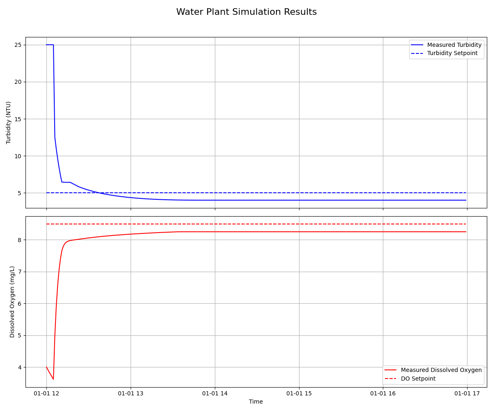
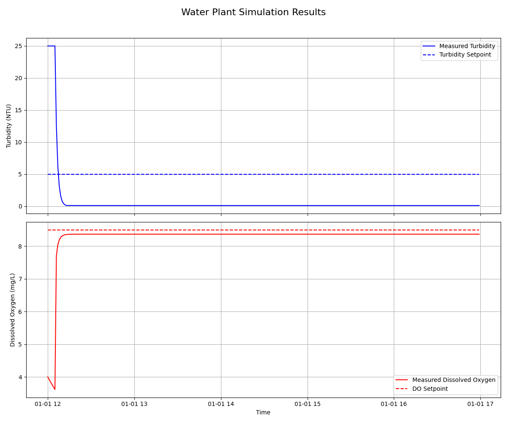

# Project Documentation: Water Plant Process Controller

## 1. Introduction

Welcome to the detailed documentation for the Water Plant Process Controller project. This document provides a comprehensive overview of the system's architecture, components, and usage.

This project is a Python-based simulation framework for a water treatment process. It is designed to demonstrate a closed-loop control system using a generic PID (Proportional-Integral-Derivative) controller to manage water quality parameters, such as turbidity and dissolved oxygen.

The primary goals of this project are:
- To provide a clear, well-structured example of control system implementation.
- To offer a reusable and configurable framework for simulating and testing control algorithms.
- To serve as an educational tool for understanding PID control and process simulation.

---

## 2. System Architecture

The project is designed with a clear separation of concerns, dividing the system into three main parts: **Models**, the **Simulator**, and the **Controller**.

```
+-----------------+      +--------------------+      +--------------------+
|   User / Test   |----->|   PID Controller   |----->|  Plant Simulator   |
|     Script      |      | (Control Algorithm)|      | (Physical Process) |
+-----------------+      +--------------------+      +--------------------+
        ^                        |                             |
        |                        |                             |
        +------------------------+-----------------------------+
                                 |
                          (Measurement)
```

1.  **Plant Simulator**: Represents the physical water treatment plant. It maintains the current state of the water (`WaterQuality`) and simulates how it changes over time in response to control actions (e.g., chemical dosing, aeration).
2.  **PID Controller**: The brain of the operation. It calculates the necessary control actions by comparing the current measured value of a water quality parameter to its desired **setpoint**.
3.  **Models**: Simple data structures (like `WaterQuality`) that define the state of the system.
4.  **User/Test Script**: The entry point that initializes the simulator and controllers, and runs the simulation loop, connecting the output of the simulator (current state) back to the input of the controller.

---

## 3. Component Deep Dive

### 3.1. `WaterQuality` Model
- **Location**: `water_plant_controller/models/water_quality.py`
- **Description**: A simple dataclass that acts as a snapshot of the water's state at a specific time.
- **Attributes**:
    - `timestamp`: `datetime` - The time of the measurement.
    - `ph`: `float` - The pH level (currently constant in the simulation).
    - `turbidity`: `float` - A measure of water cloudiness (NTU).
    - `dissolved_oxygen`: `float` - The concentration of dissolved oxygen (mg/L).

### 3.2. `PlantSimulator`
- **Location**: `water_plant_controller/simulation/plant_simulator.py`
- **Description**: Simulates the physics of the water treatment process. The `step()` method advances the simulation by one time step.
- **Key Logic**:
    - **Turbidity Reduction**: The addition of a coagulant reduces turbidity. The rate of reduction is proportional to the current turbidity and the coagulant dose.
    - **Dissolved Oxygen (DO)**: The DO level is affected by two main factors:
        1.  **Aeration**: Increases DO, pushing it towards a natural saturation point.
        2.  **Consumption**: Natural processes consume DO at a constant rate.
- **Advanced Features**:
    - **Time Delay**: The simulator includes a configurable time delay (`time_delay_steps`) to mimic real-world transport delays in pipes. Control actions are passed through a FIFO (First-In, First-Out) pipeline, so their effect is not immediate.
    - **Non-Linear Aeration**: To provide a more realistic challenge, the efficiency of aeration is non-linear. As the dissolved oxygen level approaches its saturation point, the effectiveness of aeration decreases. This is controlled by the `aeration_non_linearity` parameter.
- **Configuration**: The simulator's physical parameters (e.g., `do_increase_rate`, `time_delay_steps`) are loaded from `config/settings.py`.

### 3.3. `PIDController`
- **Location**: `water_plant_controller/control/pid_controller.py`
- **Description**: A generic and reusable PID controller that provides smooth and stable control by considering the past, present, and future error.
- **Key Methods**: `calculate`, `set_output_limits`, `set_integral_limits`.

### 3.4. `OnOffController`
- **Location**: `water_plant_controller/control/on_off_controller.py`
- **Description**: A simple "bang-bang" controller. It switches the output to its maximum value if the system is below the setpoint and to its minimum value if above the setpoint. It is easy to implement but often results in oscillations and instability.
- **Key Methods**: `calculate`, `set_output_limits`.

---

## 4. Controller Performance Comparison

To demonstrate the difference between the PID and On-Off controllers, we can run simulations with each and visualize the results.

**PID Controller Performance**
Run the simulation with the default PID controller:
`python3 run_simulation.py --controller-type pid --log-file log_pid.csv`
`python3 visualize_log.py --log-file log_pid.csv --output-image plot_pid.png`

The PID controller provides a smooth, stable response. It quickly brings the process variables to their setpoints with minimal overshoot and holds them steady.


**On-Off Controller Performance**
Run the simulation with the On-Off controller:
`python3 run_simulation.py --controller-type on-off --log-file log_on_off.csv`
`python3 visualize_log.py --log-file log_on_off.csv --output-image plot_on_off.png`

The On-Off controller causes the process variables to oscillate continuously around the setpoint. Because it can only be fully on or fully off, it cannot make fine adjustments, leading to instability and inefficiency.


---

## 5. Configuration

All key parameters are centralized in `config/settings.py`. This allows for easy tuning and experimentation without modifying the core logic.

- **`SIMULATION_DEFAULTS`**: A dictionary containing the physical constants for the `PlantSimulator`.
- **`PID_GAINS`**: A dictionary containing the `Kp`, `Ki`, and `Kd` gains for each controller used in the system.

---

## 6. Robustness and Error Handling

To make the project more reliable and user-friendly, several robustness features have been implemented.

### 6.1. Configuration Validation
Before any simulation is run, the `config/settings.py` file is automatically validated by the `config/validator.py` module. This validator checks for:
- The presence of all required configuration keys.
- The correct data type for each parameter (e.g., ensuring `time_delay_steps` is an integer).

If the configuration is invalid, the program will exit with a clear error message indicating the exact problem, preventing unexpected crashes during the simulation.

### 6.2. File I/O Error Handling
The `run_simulation.py` and `visualize_log.py` scripts include error handling for file operations. If a script is unable to read or write a log file (e.g., due to a non-existent file or incorrect permissions), it will print a user-friendly error message instead of crashing.

---

## 7. How to Run and Extend the Project

### 7.1. Running Tests
To verify the integrity of the system, run all tests from the root directory:
```bash
python3 -m unittest discover tests
```

### 7.2. Running a Simulation with Logging
The project includes a dedicated script to run the simulation, log its output to a CSV file, and visualize the results.

**Step 1: Run the Simulation**
Execute the `run_simulation.py` script. This will generate a `simulation_log.csv` file containing the time-series data of the run.
```bash
python3 run_simulation.py
```
You can customize the simulation using command-line arguments. For a full list of options, run:
```bash
python3 run_simulation.py --help
```
Example of a custom run:
```bash
python3 run_simulation.py --steps 500 --turbidity-setpoint 4.5
```

**Step 2: Visualize the Results**
After the simulation is complete, run the `visualize_log.py` script to generate a plot from the log file.
```bash
python3 visualize_log.py
```
This will read `simulation_log.csv` and create `simulation_plot.png`. You can also specify the input and output files:
```bash
python3 visualize_log.py --log-file custom_log.csv --output-image custom_plot.png
```

### 7.3. Extending the Project
This project is designed to be extensible. Here are some ideas for future improvements:
- **Advanced Simulation**: Introduce time delays, non-linear effects, or noise to the simulator for more realism.
- **New Controller Types**: Implement and compare other control strategies, such as an On-Off controller.

---
This concludes the detailed documentation. For a quick start guide, please refer to `README.md`.
